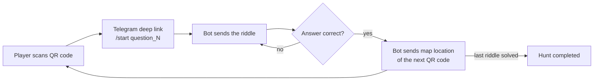

[README.md](https://github.com/user-attachments/files/28792588/README.md)
# 🗺️ Treasure Hunt Telegram Bot

A real-world treasure hunt powered by a Telegram bot, QR codes and Google Cloud Run.

Players scan a QR code placed at a physical location, which opens the bot with a riddle. Solving the riddle unlocks a **map pin to the next location**, where the next QR code is waiting — until the hunt is complete.

## How it works



1. Each QR code encodes a Telegram **deep link** (`https://t.me/<bot_name>?start=question_N`).
2. Scanning it opens the chat and tells the bot which stage the player is at.
3. The bot asks the riddle for that stage and checks the player's text answers.
4. On a correct answer, the bot replies with a **native Telegram location message** pointing to the next QR code.
5. A small helper script generates the QR codes for all stages, for testing and for printing.

## Tech stack

- **Python 3.9** with [python-telegram-bot](https://python-telegram-bot.org/) (async handlers, webhook mode)
- **Docker** — lightweight `python:3.9-slim` image
- **Google Cloud Run** — serverless container hosting, fully managed
- **Telegram Webhooks** — no polling; Telegram pushes updates straight to the Cloud Run service, with an optional secret token for extra security

## Project structure

```
telegram-bot/
├── bot_4.py            # bot logic: handlers, game state, webhook server
├── qr_generator.py     # generates the QR codes for each stage
├── requirements.txt
└── Dockerfile
```

## Configuration

All configuration is injected via environment variables — no secrets in the code or in the image.

| Variable | Required | Description |
|---|---|---|
| `TELEGRAM_BOT_TOKEN` | ✅ | Bot token from [@BotFather](https://t.me/BotFather) |
| `CLOUD_RUN_SERVICE_URL` | ✅ | Public URL of the Cloud Run service (no trailing slash) |
| `WEBHOOK_PATH` | – | Custom path for the webhook endpoint (good practice: don't use the token) |
| `WEBHOOK_SECRET` | – | Optional secret token validated on every Telegram update |
| `PORT` | – | Listening port (Cloud Run injects `8080` by default) |

On Cloud Run, set them under **Service → Edit & deploy new revision → Variables & secrets**.

## Running locally

```bash
pip install -r requirements.txt
export TELEGRAM_BOT_TOKEN="your-token"
export CLOUD_RUN_SERVICE_URL="https://your-tunnel-or-service-url"
python bot_4.py
```

> For local webhook testing you need a public HTTPS URL (e.g. an [ngrok](https://ngrok.com/) tunnel) so Telegram can reach the bot.

## Deploying to Google Cloud Run

```bash
# 1. Build the image
docker build -t telegram-bot .

# 2. Tag it for the project registry
docker tag telegram-bot gcr.io/<your-project-id>/telegram-bot

# 3. Push it
docker push gcr.io/<your-project-id>/telegram-bot

# 4. Deploy
gcloud run deploy telegram-bot \
  --image gcr.io/<your-project-id>/telegram-bot \
  --platform managed \
  --region <your-region>
  --allow-unauthenticated
```

To tear the service down:

```bash
gcloud run services delete telegram-bot --region <your-region>
```

## Bot commands

| Command | Action |
|---|---|
| `/start` | Start the hunt (or jump to a stage via QR deep link) |
| `/help` | Show how the game works |
| `/reset` | Reset the player's progress |

## Known limitations & roadmap

This started as a learning project for Docker, webhooks and Cloud Run, so a few trade-offs are intentional:

- **In-memory game state** — player progress lives in a Python dict, so it resets when the container restarts (and Cloud Run can scale to zero). Next step: move state to Firestore or Redis.
- **Hardcoded riddles** — questions and coordinates are defined in the source. Next step: load them from a config file or a small admin API (FastAPI).
- **Single instance assumption** — with persistent state, the bot could scale horizontally.

## License

MIT — feel free to use this for your own treasure hunts.
